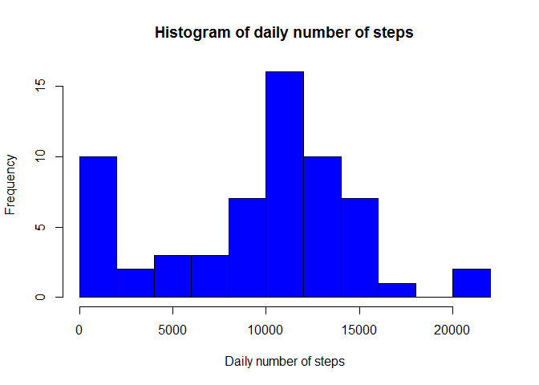
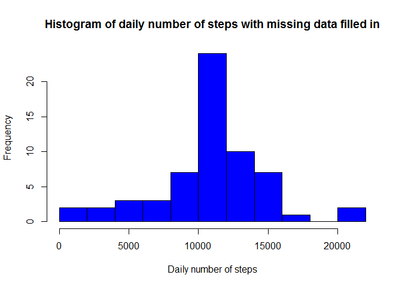
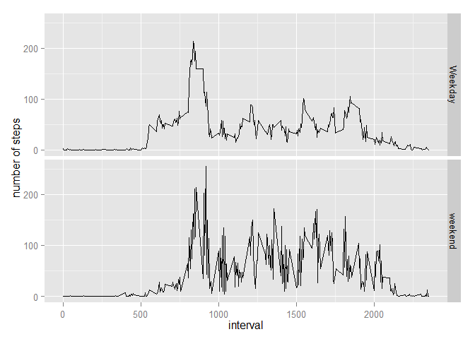

# Reproducible Research: Peer Assessment 1
Montserrat Perez  
Friday, May 15, 2015  
We use data from a personal monitoring device. This device collects data at 5 minute intervals through out the day. The data consists of two months of data from an anonimous individual collected during the months of October and November 2012 and include the number of steps taken during each 5 minute interval 

##Loading and preprocessing the data

First we load packages dplyr and lubridate to manipulate the data  


```r
library(lubridate)
```

```
## Warning: package 'lubridate' was built under R version 3.1.2
```

```r
library (dplyr)
```

```
## Warning: package 'dplyr' was built under R version 3.1.2
```

```
## 
## Attaching package: 'dplyr'
## 
## The following objects are masked from 'package:lubridate':
## 
##     intersect, setdiff, union
## 
## The following object is masked from 'package:stats':
## 
##     filter
## 
## The following objects are masked from 'package:base':
## 
##     intersect, setdiff, setequal, union
```

The dataset is stored in a csv file and there are 17,568 observations in the dataset. We now read the data and convert the date column to a POSIXct format for easy manipulation


```r
activity <- read.csv("activity.csv")
activity$date <- ymd(activity$date)
activity <- tbl_df(activity)
```

##What is mean total number of steps taken per day?

We calculate the total number of steps taken per day. We ignore missing values for the moment. 


```r
totaldaily <- activity %>% group_by(date) %>% summarise(total_daily = sum(steps, na.rm=TRUE))
```

Now we make a histogram of the total daily number of steps
 

```r
histogram <- hist(totaldaily$total_daily, breaks=10, xlab= "Daily number of steps",
                  main ="Histogram of daily number of steps", col= "blue")
```

 

We will now calculate the mean and median of the daily number of steps


```r
mean(totaldaily$total_daily)
```

```
## [1] 9354
```

```r
median(totaldaily$total_daily)
```

```
## [1] 10395
```

## What is the average daily activity pattern?

We make a time series plot of the average nUmber of steps taken averaged across all days


```r
averageinterval <- activity %>% group_by(interval) %>% summarise(average_interval =mean(steps, na.rm=TRUE))

with (averageinterval, plot(average_interval~ interval, type = "l", xlab="interval", ylab="average steps", main= "average daily activity pattern"))
```

 

We now calculate which 5 minute interval, on average across all the days in the dataset, contains the maximum number of steps


```r
averageinterval %>% arrange(interval,desc(average_interval)) %>% top_n(1) %>% print()
```

```
## Selecting by average_interval
```

```
## Source: local data frame [1 x 2]
## 
##   interval average_interval
## 1      835            206.2
```

## Imputing missing values

First we count the number of missing values of the variable steps


```r
sum(is.na(activity$steps))
```

```
## [1] 2304
```

We then replace the missing values with the average for that interval accross all the days of the trial


```r
activity1 <- activity %>% group_by(interval) %>% mutate(interval_mean = mean(steps,na.rm=TRUE )) %>% ungroup()

activity1$steps <- as.character(activity1$steps)
activity1$interval_mean <- as.character(activity1$interval_mean)


activity1$steps2 <- with(activity1, 
                 ifelse(is.na(activity1$steps), activity1$interval_mean, activity1$steps))
```

We now create a dataset equal to the original with missing data filled in


```r
activity2 <- activity1 %>% select(steps2, date, interval)
activity2$steps2 <- as.numeric(activity2$steps2)
```

We now create a histogram of total mumber of steps using the dataset with the missing values filled in


```r
totaldaily1 <- activity2 %>% group_by(date) %>% summarise(total_daily1 = sum(steps2,
                        na.rm=FALSE))
histogram <- hist(totaldaily1$total_daily1, breaks=10, xlab= "Daily number of steps",
                  main ="Histogram of daily number of steps with missing data filled in",
                  col= "blue")
```

 

We now recalculate the mean and the median


```r
mean(totaldaily1$total_daily1)
```

```
## [1] 10766
```

```r
median(totaldaily1$total_daily1)
```

```
## [1] 10766
```

## Are there differences in activity patterns between weekdays and weekends?

To explore the difference in patterns between weekdays and weekends,we create a two level factor variable that separates weekedays from weekends


```r
activity2$weekend <- with(activity2,
                          ifelse(wday(date) == c(1,7), "weekend", "Weekday"))

activity2$weekend <- as.factor(activity2$weekend)
averageinterval2 <- activity2 %>% group_by(weekend,interval) %>% summarise(average_interval =mean(steps2, na.rm=FALSE))
```
 
We now make a panel plot containing a time series that separates the average number of steps taken in weekdays from those taken on weekends


```r
library(ggplot2)
```

```
## Warning: package 'ggplot2' was built under R version 3.1.3
```

```r
qp <-qplot(interval, average_interval, data = averageinterval2, facets = weekend~ . ,
      geom ="line", ylab ="number of steps") 
print(qp)
```

 
 
